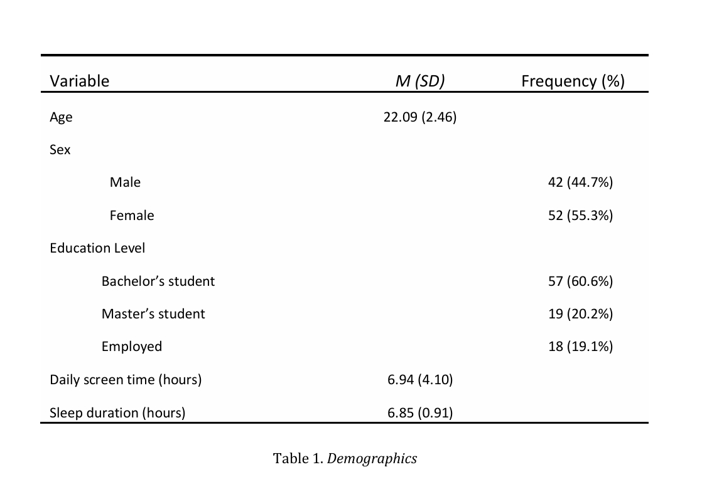
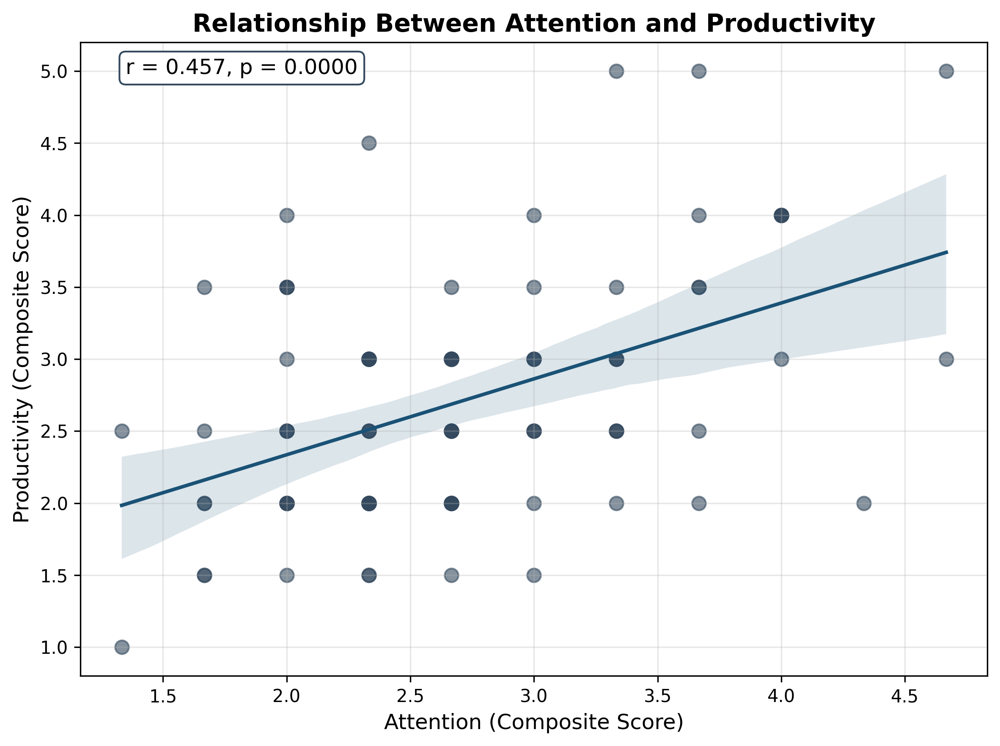

### Research & Tech Stack

<a href="https://www.notion.so/"></a>
<a href="https://www.researchgate.net/"></a>
<a href="https://arxiv.org/"></a>
<a href="https://www.sciencedirect.com/"></a>
<a href="https://www.overleaf.com/"></a>
<a href="https://www.python.org/"></a>
<a href="https://jasp-stats.org/"></a>
<a href="https://github.com/16kai-ad/smartphone-attention-productivity-study"></a>
<a href="https://www.latex-project.org/"></a>


## Smartphone Usage Patterns and Their Association with Attention and Productivity
This repository contains the full research pipeline for my preprint study investigating the relationship between smartphone usage patterns, attention, productivity, and procrastination among young adults aged 18–30.
The project combines **statistical analysis**, **behavioral research**, and **machine learning techniques** to explore whether smartphone usage patterns are associated with cognitive and productivity-related outcomes.

Smartphones are deeply integrated into modern daily life, especially among students and young professionals. While prior research often suggests a negative relationship between smartphone use and academic or cognitive performance, findings remain inconsistent.

This project examines whether:
- overall smartphone screen time predicts attention and productivity,
- context-specific behaviors (e.g., phone use during studying, morning phone checking) are stronger predictors,
- attention mediates the relationship between smartphone use and productivity,
- distinct behavioral profiles of smartphone users can be identified.

<p align="center">

</p>

### Hypothesis Testing
| Hypothesis | Result | Key Stats |
| :--- | :--- | :--- |
| **H1:** Smartphone usage negatively associated with attention. | ❌ Not supported | Overall screen time: \(r = 0.014, p = .897\) |
| **H2:** Attention positively associated with productivity, negatively with procrastination. | ⚠️ Partially supported | Prod.: \(r = 0.457, p < .001\) <br> Procrast.: \(r = 0.440, p < .001\) |
| **H3:** Attention mediates the relationship between usage and productivity. | ❌ Not supported | Bootstrap 95% CI [-0.054, 0.070] |

## Reproducibility Guide
1. Clone the repository
```bash
git clone https://github.com/16kai-ad/smartphone-attention-productivity-study.git
cd smartphone-attention-productivity-study
```
2. Create a virtual enviroment (recommended)
```
python -m venv venv
venv\Scripts\activate
```
3. Install dependencies
```
pip install -r requirements.txt
``` 
## Behavioral Profiles (K-Means Clustering)
We identified 3 distinct clusters of smartphone users. While they didn't differ in attention or productivity, they showed significant differences in procrastination 
> $$
> F(2, 91) = 3.97, \quad p = .022, \quad \eta^2 = .080
> $$

Post-hoc tests revealed that Cluster 1 (high screen time, high stress) reported significantly higher procrastination than Cluster 0 (low stress, no morning checking).

<p align="center">

</p>


## Citation

```
bibtex
@article{idimova2026smartphone,
  title={Smartphone Usage Patterns and Their Association with Attention and Productivity among Young Adults},
  author={Idimova, Adelya},
  journal={IIT University Research},
  year={2026},
  doi={10.5281/zenodo.21040756}
}
```

